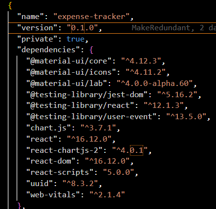

# Expense Tracker
https://expenses-incomes-tracker.netlify.app  

## 📄 Description 

An intuitive web application designed to help users efficiently manage their finances by tracking their incomes and expenses. Built with React and styled using Material-UI, this application offers a seamless and visually appealing user experience. One of its standout features is the integration of local storage, allowing users to conveniently save their input data, ensuring that their financial records are easily accessible and persistent across sessions. With its user-friendly interface and robust functionality, the Income and Expense Tracker empowers users to make informed financial decisions and maintain better control over their finances.


[](https://app.netlify.com/sites/expenses-incomes-tracker/deploys) 


## 📓 Table of Contents
- [Expense Tracker](#expense-tracker)
  - [📄 Description](#-description)
  - [📓 Table of Contents](#-table-of-contents)
  - [💡🏡 Lighthouse](#-lighthouse)
  - [🪛 Technologies used](#-technologies-used)
  - [🖥️ Installation](#️-installation)
  - [💬 Usage](#-usage)
  - [🖼️ Screenshot](#️-screenshot)
  - [📹 Video](#-video)
  - [⚖️ License](#️-license)
  - [🤝 Contributing](#-contributing)
  - [🛠️ Tests](#️-tests)
  - [❔ Questions](#-questions)

## 💡🏡 Lighthouse
This is the Lighthouse Google report showcasing Performance 🚀, Accessibility ♿️, Best practices ✅, and SEO 🔍.


## 🪛 Technologies used 

| Technology                | Description                               | Link                                                    |
|---------------------------|-------------------------------------------|---------------------------------------------------------|
| Github licence            | License badge                             |  |
| JavaScript Badge          | JavaScript badge                          |  |
| Material-UI Core Version  | Version of Material-UI Core               |  |
| Material-UI Icons Version | Version of Material-UI Icons              |  |
| Material-UI Lab Version   | Version of Material-UI Lab                |  |
| Jest-Dom Version          | Version of Jest-Dom                       |  |
| React Testing Library Version | Version of React Testing Library       |  |
| User Event Version        | Version of User Event                     |  |
| Chart.js Version          | Version of Chart.js                       |  |
| React Version             | Version of React                          |  |
| React Chartjs 2 Version  | Version of React Chartjs 2                |  |
| React DOM Version         | Version of React DOM                      |  |
| React Scripts Version     | Version of React Scripts                  |  |
| UUID Version              | Version of UUID                           |  |
| Web Vitals Version        | Version of Web Vitals                     |  |
| Local Storage             | Local Storage badge                       |  |
| Netlify Status            | Netlify status badge                      | [](https://app.netlify.com/sites/expenses-incomes-tracker/deploys) |

    
## 🖥️ Installation 
Users can clone the code and run npm install to install the dependencies
```pip
 npm install 
```

Afterwards users can run the command ```npm run build``` which will run the Vite build process which will bundle the React source code
```pip
npm run build
```

Afterwards users can run the command ```npm run dev``` which will executes the vite command, which starts the development server provided by Vite  
and allows users to run the code on their local host
```pip
npm run dev
```
This sequence ensures that your client-side code is built before starting the server.

Package.json dependencies ⚙️  


## 💬 Usage 
Have fun!

## 🖼️ Screenshot

Landing page


## 📹 Video
GIF  
Showcasing Homepage, adding a item to the cart and scroll button

  
## ⚖️ License 
This project is licensed under MIT
  
## 🤝 Contributing 
N/A
  
## 🛠️ Tests
N/A
 
## ❔ Questions
If you have any questions about this project, please contact me directly at brian.trang9@gmail.com. Feel free to view more of my projects at https://github.com/Makeredundant.